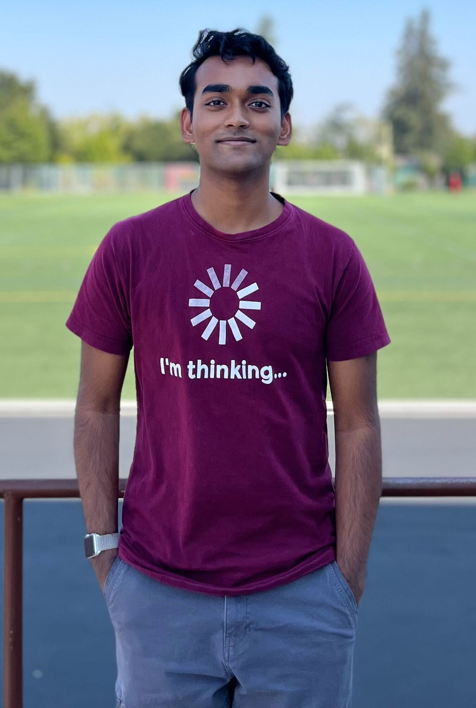
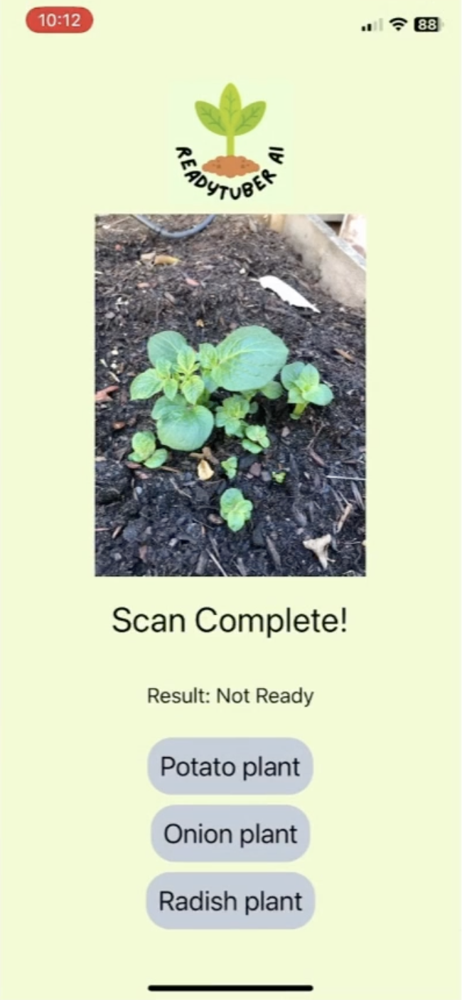
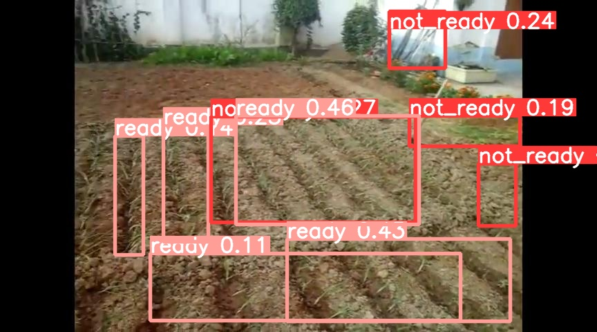
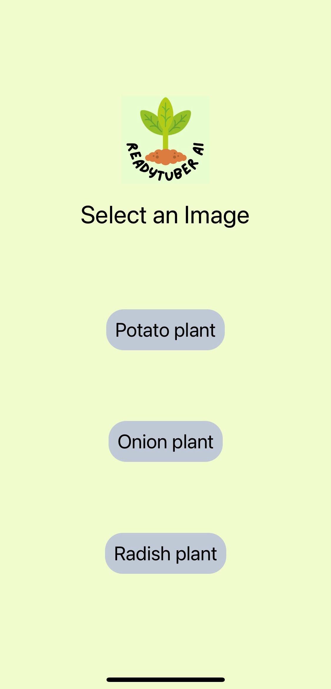

Hi! I'm Prarthan, a high school senior in the Bay Area. With a solid background in coding, I'm particularly interested in projects around **AI and the brain**.

    

In addition to my academic interests, I have a keen interest in writing, chess, debate, and piano.

## Example Project(s)

Here are some of my projects! A lot of my projects are personal explorations, and not really designed to share with the world--but here's one which is!

### ReadyTuber AI

    

Have you ever tried to grow potatoes? It's pretty easy—-they don't have complex requirements for soil, watering, or sunlight. But they _do_ grow undergroud, making it very tough to tell when they're ready or not.

I would know—-during the pandemic, I tried to grow potatoes. 3 times I tried, 3 times I pulled them up prematurely. 

This problem inspired my 2022 science fair project (I got 2nd in Senior Plant Biology at CSEF!), and culminated into ReadyTuber AI. Just take a simple picture of a plant, and the app will tell you whether the plant is ready or not!

Internally, the app has two main components: a custom YOLOv8 that identifies the plant, and a model built in TensorFlow that classifies the plant as "ready" or "not ready."

My initial approach only employed YOLO. However, YOLO's performance was underwhelming, yielding only about 50% accuracy—-no better than random chance. In retrospect, I realized why. YOLO, typically adept at identifying distinct objects quickly, struggled to differentiate between similar elements in each image, such as leaves, stems, and dirt.

  

Realizing the need for a more tailored solution, I pivoted to creating a custom model using TensorFlow. This shift demanded a complete reevaluation of the model's components and their layout. Despite the limited dataset (only 140 images for onion plants) and the inherent complexity of distinguishing subtle variations in tubers, the new model has over 80% accuracy and precision. This breakthrough is pretty significant, especially considering the functional challenges and the similarity in visual cues across images.

  

The journey wasn't without its hurdles. Data scarcity was a major obstacle; organized, pre-labeled datasets for this niche application were non-existent. Manually labeling images was a tedious and time-consuming task, often complicated by the ambiguous nature of tuber maturity. Additionally, many images were of poor quality or lacked variability in factors like lighting.

Despite these challenges, the project was a success, meeting my engineering goals for all three targeted plants: potatoes, onions, and radishes. The app has been in review for a couple of weeks now, and I hope that it'll be available on the App Store soon!

### Research Internship
I'm an intern at the <a href="https://roybens.faculty.ucdavis.edu/"> Ben-Shalom Lab</a> at UC Davis!

Beginning since my sophomore year, my work in the lab has involved working on a <a href="https://www.frontiersin.org/articles/10.3389/fninf.2022.882552/full">genetic algorithm</a> (GA) that convexifies the parameter spaces of single-cell biophysical neuronal models. Fundamentally, a neuron's excitability is determined by the conductance of ion channels along its membrane. Some neurological disorders like myotonia, epilepsy, and developmental delays are caused by disruptions of these channels—therefore, reverse engineering neuronal excitability through these models will increase understanding and treatments for these neurological conditions.

There's a lot I've been doing, but what's reflected in published work (so far!) is my contribution to implementing linear, lasso, and ridge regression to validate the GA’s minimization function inside of its objective function. This work contributed to a presentation at the <a href="https://www.abstractsonline.com/pp8/#!/10619/presentation/74215">Neuroscience 2022 Conference</a>.
